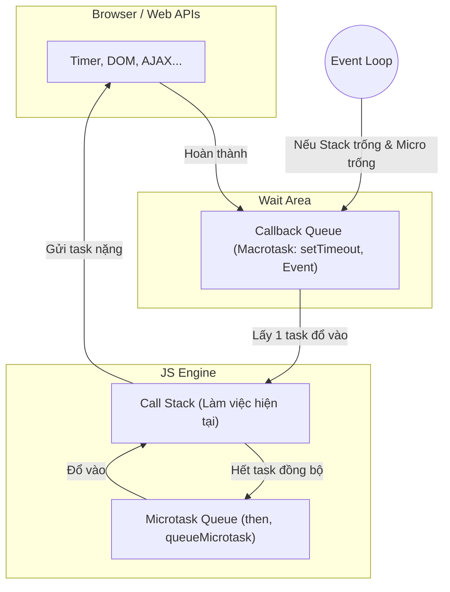

# Câu hỏi về Kỹ thuật (Technical Answers)

Tài liệu này tập trung vào các câu hỏi nền tảng và nâng cao về JavaScript, React và Kiến trúc Frontend.

---

## 1. Nền tảng JavaScript & React

### Q1: Giải thích Event Loop và tại sao UI bị block?
**Gợi ý trả lời:**
- "JavaScript là single-threaded. Event Loop giúp nó xử lý bất đồng bộ bằng cách phối hợp giữa **Call Stack**, **Web APIs**, và các **Task Queues**."

---

### 🏗️ Cấu tạo của Event Loop hệ thống
Để trả lời phỏng vấn ở mức Senior, anh cần mô tả rõ 4 thành phần này:

1.  **Call Stack (LIFO):** Nơi chứa các hàm đang được thực thi. JS chỉ làm được 1 việc tại 1 thời điểm ở đây.
2.  **Web APIs:** Các tính năng của trình duyệt (Timer, DOM, Fetch). Khi gặp `setTimeout` hay `fetch`, JS đẩy việc này sang Web APIs để xử lý song song.
3.  **Microtask Queue (Ưu tiên cao):** Chứa các callback từ `Promise (.then/catch)`, `MutationObserver`.
4.  **Macrotask Queue (Task Queue):** Chứa callback từ `setTimeout`, `setInterval`, `setImmediate`, I/O, UI rendering.

---

### 🔄 Quy trình hoạt động (The Event Loop Cycle)
Quy trình này lặp đi lặp lại vô tận (Loop):

1.  **Execute Synchronous:** Chạy hết code đồng bộ trong Call Stack.
2.  **Microtasks:** Sau khi Stack trống, Event Loop kiểm tra Microtask Queue. Nó sẽ chạy **TẤT CẢ** các task trong hàng chờ này cho đến khi sạch bóng.
3.  **Render (Option):** Trình duyệt kiểm tra xem có cần cập nhật UI không.
4.  **Macrotask:** Event Loop lấy **DUY NHẤT 1** tác vụ từ Macrotask Queue đẩy vào Stack để chạy.
5.  **Repeat:** Quay lại bước 2 (Kiểm tra Microtask).

---

### Sơ đồ trực quan về Event Loop (UI Visualization)

- "UI bị block khi Call Stack đang xử lý một tác vụ tính toán quá nặng (vd: loop qua 1 triệu item). Lúc này trình duyệt không thể xử lý tác vụ Render hay Event của người dùng. Để xử lý, chúng ta nên dùng Web Worker hoặc chia nhỏ task (chunking) bằng `requestIdleCallback`."

### Q2: Redux vs Context API trong dự án lớn?
**Gợi ý trả lời:**
- "Context API phù hợp cho các state ít thay đổi (theme, locale, user info). Tuy nhiên, nó dễ gây ra redundant re-render vì mỗi khi context value thay đổi, toàn bộ consumer đều re-render."
- "Redux (với Toolkit) cung cấp cơ chế 'selectors' mạnh mẽ, chỉ re-render component khi dữ liệu cụ thể mà nó cần thay đổi. Với dự án lớn tại LG CNS, Redux giúp quản lý state tập trung, dễ debug (DevTools) và đảm bảo hiệu năng tốt hơn."

### Q3: Tối ưu hóa Table hàng ngàn dòng?
**Gợi ý trả lời:**
- "Tôi sẽ áp dụng kỹ thuật **Windowing / Virtualization** (dùng thư viện như `react-window` hoặc `react-virtualized`). Chỉ render những dòng đang hiển thị trên màn hình (viewport)."
- "Ngoài ra, tôi sẽ dùng `memo` cho các row component và `useCallback` cho các handler để tránh re-render không cần thiết."

---

## 2. Xử lý Dữ liệu lớn & Web Workers

### Q4: Xử lý dữ liệu lớn (Big Data in FE)
- **Câu hỏi:** "Nếu Backend trả về hàng chục ngàn dữ liệu trading cũ để vẽ biểu đồ, anh xử lý ở FE như thế nào để không treo trình duyệt?"
- **Gợi ý trả lời:**
    - "Tôi sẽ dùng **Web Workers** để xử lý tính toán dữ liệu ở background thread, tránh block main thread (UI thread)."
    - "Áp dụng kỹ thuật **Data Downsampling** (chỉ lấy các điểm dữ liệu đại diện để vẽ) thay vì cố render tất cả."

### 💡 Giải giải thích Web Worker (Analogy)
Hãy tưởng tượng trình duyệt như một **Nhà Hàng**:
*   **Main Thread:** Là **Đầu bếp chính**. Ông ấy làm mọi thứ: nấu ăn, bày đĩa, và trả lời khách hàng (UI). Nếu có món ăn cực khó, ông ấy đứng bếp rất lâu -> Nhà hàng ngừng nhận khách.
*   **Web Worker:** Là **Phụ bếp** ở phòng khác. Nhận nguyên liệu, làm xong thì đưa lại cho Đầu bếp chính bày đĩa. Nhà hàng vẫn phục vụ khách mượt mà.

---

## 4. Copying Objects (Shallow vs Deep Copy)

### Q7: Phân biệt Shallow Copy và Deep Copy?
**Gợi ý trả lời:**
- **Shallow Copy (Sao chép nông):** Chỉ sao chép các giá trị ở tầng đầu tiên. Nếu đối tượng có các đối tượng lồng nhau, nó chỉ sao chép **tham chiếu (reference)** của các đối tượng đó. Nghĩa là thay đổi ở đối tượng con sẽ ảnh hưởng đến cả bản gốc và bản sao.
- **Deep Copy (Sao chép sâu):** Sao chép toàn bộ đối tượng và tất cả các đối tượng con lồng bên trong nó một cách độc lập. Thay đổi ở bất kỳ đâu trong bản sao cũng không ảnh hưởng đến bản gốc.

### Các cách thực hiện:
1.  **Shallow Copy:** `Object.assign()`, Spread operator (`{...obj}`).
2.  **Deep Copy:** 
    - `JSON.parse(JSON.stringify(obj))` (Cổ điển nhưng có hạn chế: mất Function, Date, Undefined).
    - `structuredClone(obj)` (Modern API - Khuyên dùng).
    - Thư viện ngoài như `_.cloneDeep` của Lodash.

---

## 2. React & Frontend Frameworks

### Q3: Virtual DOM hoạt động như thế nào? (Quy trình 3 bước)
Nhà tuyển dụng muốn thấy anh hiểu về "Reconciliation". Hãy trình bày theo 3 bước:
1.  **Render:** Khi State thay đổi, React tạo ra một cây Virtual DOM mới (một đối tượng JS nhẹ).
2.  **Diffing:** React so sánh cây mới này với cây cũ (Snapshot trước đó) để tìm ra chính xác những gì đã thay đổi.
3.  **Commit:** Chỉ những phần thay đổi mới được cập nhật thực sự lên DOM của trình duyệt. 
- **Ẩn dụ:** Giống như anh muốn sửa một căn nhà. Thay vì đập đi xây lại hết (Real DOM), anh vẽ bản thiết kế mới rồi chỉ thợ đến thay đúng cái bóng đèn bị hỏng (Virtual DOM).

### Q4: Quy trình tối ưu hiệu năng (Performance Audit)
Tại LG CNS, các dự án SI lớn thường gặp vấn đề lag khi dữ liệu nhiều. Anh hãy trình bày quy trình 5 bước để tối ưu:
1.  **Đo lường (Measure):** Dùng React DevTools Profiler để tìm component bị re-render thừa.
2.  **Xử lý Re-render:** Dùng `React.memo`, `useMemo`, `useCallback` để chặn các render không cần thiết.
3.  **Tối ưu danh sách:** Dùng **Windowing/Virtualization** (`react-window`) cho các bảng dữ liệu hàng ngàn dòng.
4.  **Tối ưu Bundle:** Thực hiện **Code Splitting** (`React.lazy`, Dynamic Import) để giảm dung lượng file JS tải lần đầu.
5.  **Tối ưu Asset:** Dùng CDN, nén ảnh bằng WebP, và tận dụng Browser Caching.

---

## 3. Design Patterns & Kiến trúc SI (System Integration)

Tại các công ty như LG CNS, mã nguồn thường rất lớn. Anh nên nói về cách áp dụng Pattern để giữ code sạch:

1.  **Container & Presentational Pattern:** Tách biệt logic (Fetch data, xử lý event) ra khỏi UI (Chỉ hiển thị).
2.  **Custom Hooks Flow:** Đóng gói logic nghiệp vụ phức tạp về Loan/Trading vào các Hooks riêng để tái sử dụng và dễ Unit Test.
3.  **Compound Components:** Dùng cho các UI phức tạp như Tab, Select, Modal để tăng tính linh hoạt.

---
### Q6: Clean Architecture
- "Áp dụng mô hình lớp: **Domain Layer** (Logic thuần), **Data Layer** (API/Caching), và **UI Layer** (Hiển thị)."
