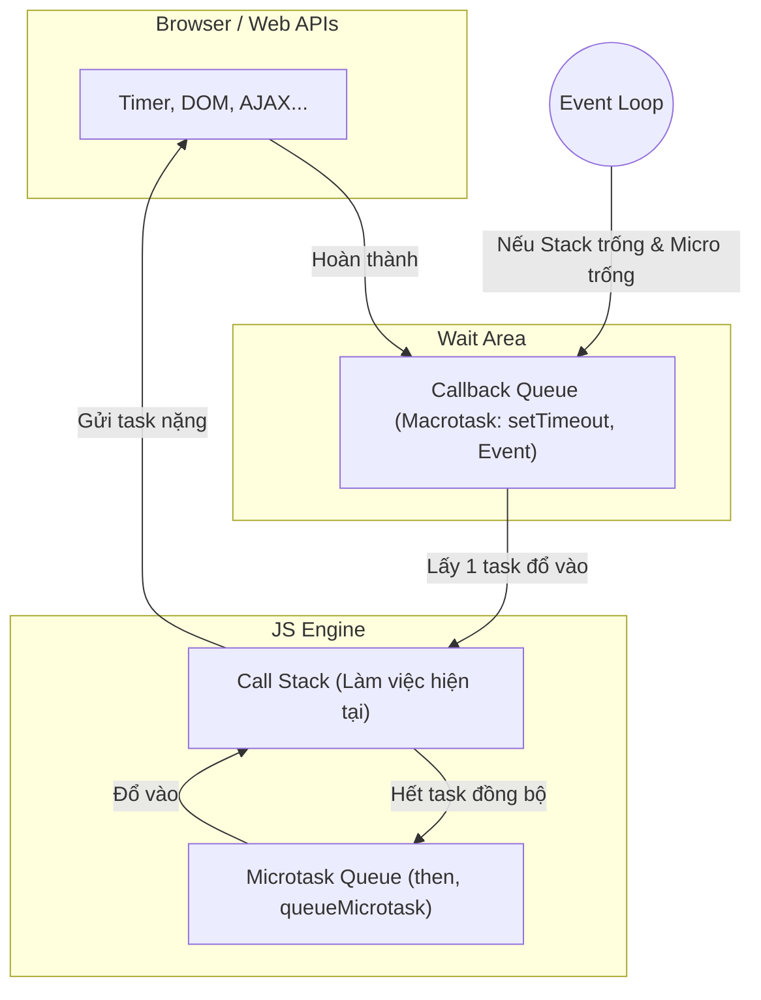

# Hướng dẫn trả lời câu hỏi phỏng vấn Frontend - LG CNS

Tài liệu này cung cấp các gợi ý trả lời cho các câu hỏi quan trọng, giúp anh thể hiện được tư duy của một Senior FE Dev (4 năm kinh nghiệm).

---

## 1. Kỹ thuật (Technical)

### Q1: Giải thích Event Loop và tại sao UI bị block?
**Gợi ý trả lời:**
- "JavaScript là single-threaded. Event Loop giúp nó xử lý bất đồng bộ bằng cách đẩy các tác vụ nặng (như API calls, Timers) vào Web APIs, sau đó đưa kết quả vào Callback Queue."

### Sơ đồ trực quan về Event Loop (UI Visualization)

- "UI bị block khi Call Stack đang xử lý một tác vụ tính toán quá nặng (vd: loop qua 1 triệu item). Lúc này trình duyệt không thể xử lý tác vụ Render hay Event của người dùng. Để xử lý, chúng ta nên dùng Web Worker hoặc chia nhỏ task (chunking) bằng `requestIdleCallback`."

### Q2: Redux vs Context API trong dự án lớn?
**Gợi ý trả lời:**
- "Context API phù hợp cho các state ít thay đổi (theme, locale, user info). Tuy nhiên, nó dễ gây ra redundant re-render vì mỗi khi context value thay đổi, toàn bộ consumer đều re-render."
- "Redux (với Toolkit) cung cấp cơ chế 'selectors' mạnh mẽ, chỉ re-render component khi dữ liệu cụ thể mà nó cần thay đổi. Với dự án lớn tại LG CNS, Redux giúp quản lý state tập trung, dễ debug (DevTools) và đảm bảo hiệu năng tốt hơn."

### Q3: Tối ưu hóa Table hàng ngàn dòng?
**Gợi ý trả lời:**
- "Tôi sẽ áp dụng kỹ thuật **Windowing / Virtualization** (dùng thư viện như `react-window` hoặc `react-virtualized`). Chỉ render những dòng đang hiển thị trên màn hình (viewport)."
- "Ngoài ra, tôi sẽ dùng `memo` cho các row component và `useCallback` cho các handler để tránh re-render không cần thiết."

---

## 2. Quy trình & Dự án (Process & Project)

### Q4: Quy trình xử lý Bug trên Production?
**Gợi ý trả lời:**
- "Bước 1: **Identify & Reproduce**. Tìm log (Sentry/LogRocket) để hiểu nguyên nhân và tái hiện lỗi ở môi trường Dev/Staging."
- "Bước 2: **Hotfix**. Team sẽ fix nhanh và run regression test để đảm bảo không break tính năng khác."
- "Bước 3: **Deploy & Monitor**. Deploy hotfix và theo dõi sát sao."
- "Bước 4: **Post-mortem**. Họp team để rút kinh nghiệm và bổ sung unit test tránh lỗi lặp lại."

---

## 3. Câu hỏi về Văn hóa (Culture)

### Q5: Tại sao anh chọn LG CNS thay vì các công ty khác?
**Gợi ý trả lời:**
- "Tôi đánh giá cao LG CNS ở quy trình làm việc chuyên nghiệp chuẩn quốc tế và khả năng thực hiện các dự án SI (System Integration) quy mô cực lớn. Với 4 năm kinh nghiệm, tôi muốn thử thách bản thân ở những hệ thống phức tạp mà chỉ những tập đoàn như LG mới có."

---

## 4. Tình huống Dự án cụ thể (Loan & Trading)
*Các dự án về Tài chính đòi hỏi sự chính xác tuyệt đối và hiệu năng cao.*

### Tình huống 1: "Hãy kể về một tính năng phức tạp anh từng build (Dự án Trading)"
- **S (Situation):** Dự án Trading cần hiển thị biểu đồ và bảng lệnh (Order Book) cập nhật thời gian thực (Real-time) thông qua WebSocket. Khi thị trường biến động mạnh, số lượng message đổ về rất lớn khiến UI bị giật lag (dropped frames).
- **T (Task):** Nhiệm vụ của tôi là tối ưu hóa việc render để đảm bảo người dùng có thể thao tác mượt mà ngay cả khi dữ liệu thay đổi liên tục.
- **A (Action):**
    - Tôi triển khai cơ chế **Throttling/Batching**: Thay vì render mỗi khi có message mới, tôi gom các cập nhật lại và chỉ render mỗi 100-200ms.
    - Sử dụng `React.memo` và `useMemo` cực kỳ chặt chẽ cho các cell trong bảng lệnh.
    - Áp dụng **Canvas API** thay vì SVG/DOM cho các thành phần đồ họa phức tạp để giảm tải cho main thread.
- **R (Result):** Tỷ lệ CPU usage giảm 50%, hiện tượng giật lag hoàn toàn biến mất, mang lại trải nghiệm mượt mà cho trader.

### Tình huống 2: "Khó khăn lớn nhất anh gặp phải là gì? (Dự án Loan/Cho vay)"
- **S (Situation):** Trong dự án Loan, quy trình đăng ký khoản vay (Loan Application) rất phức tạp với hơn 10 bước, hàng trăm trường dữ liệu và logic phụ thuộc chéo (Vd: Chọn loại tài sản A thì mới hiện trường B).
- **T (Task):** Khó khăn là quản lý state khổng lồ này sao cho dữ liệu luôn đồng nhất (consistency), người dùng có thể lưu nháp và quay lại đúng bước cũ mà không mất dữ liệu.
- **A (Action):**
    - Tôi thiết kế kiến trúc **Form State tập trung** dùng Redux kết hợp với cơ chế **Versioning**. Mỗi khi người dùng thay đổi, dữ liệu được validate và tự động lưu vào `indexedDB` để phòng trường hợp mất mạng.
    - Tách nhỏ các bước thành các sub-components độc lập, giao tiếp qua một `FormContext` để tránh việc truyền props quá sâu (prop drilling).
    - Viết một bộ **Schema Validation động** (dùng Yup) có thể thay đổi tùy theo dữ liệu từ Backend trả về.
- **R (Result):** Tỷ lệ người dùng hoàn tất hồ sơ vay tăng 25%, giảm thiểu tối đa các lỗi sai sót dữ liệu khi gửi lên server.

---

## 6. Câu hỏi Nâng cao & Chuyên sâu (Advanced)
*Dành cho ứng viên Senior, tập trung vào kiến trúc và tư duy hệ thống.*

### Q6: Bảo mật trong Fintech (Security)
- **Câu hỏi:** "Ứng dụng Loan/Trading của anh xử lý các cuộc tấn công XSS và CSRF như thế nào? Anh lưu trữ Token (JWT) ở đâu để an toàn nhất?"
- **Gợi ý trả lời:** 
    - "Để chống XSS, tôi luôn sanitize dữ liệu đầu vào và dùng cơ chế tự động escape của React. Ngoài ra, thiết lập **Content Security Policy (CSP)** là bắt buộc."
    - "Với CSRF, chúng tôi dùng **SameSite Cookie (Strict/Lax)** và đính kèm Anti-CSRF Token trong các request thay đổi dữ liệu."
    - "Về Token, không nên lưu trong `localStorage` vì dễ bị XSS. Tốt nhất là lưu trong **HttpOnly Cookie** hoặc lưu ở memory của ứng dụng (nếu dùng cơ chế Refresh Token)."

### Q7: Kiểm thử (Testing Strategy)
- **Câu hỏi:** "Với một quy trình Loan phức tạp, anh thiết kế chiến lược Testing như thế nào?"
- **Gợi ý trả lời:**
    - "Tôi áp dụng **Testing Pyramid**. Các logic tính toán lãi suất, validation sẽ được cover 100% bằng **Unit Test (Jest)**."
    - "Các flow đi qua nhiều bước (Multi-step form) sẽ được kiểm thử bằng **Integration Test (React Testing Library)** để đảm bảo state được truyền đúng giữa các bước."
    - "Cuối cùng là các luồng Happy Path chính (Vd: Gửi hồ sơ vay thành công) sẽ dùng **E2E Test (Cypress/Playwright)**."

### Q8: Xử lý dữ liệu lớn (Big Data in FE) & Web Workers
- **Câu hỏi:** "Nếu Backend trả về hàng chục ngàn dữ liệu trading cũ để vẽ biểu đồ, anh xử lý ở FE như thế nào để không treo trình duyệt?"
- **Gợi ý trả lời:**
    - "Tôi sẽ dùng **Web Workers** để xử lý tính toán dữ liệu ở background thread, tránh block main thread (UI thread)."
    - "Áp dụng kỹ thuật **Data Downsampling** (chỉ lấy các điểm dữ liệu đại diện để vẽ) thay vì cố render tất cả."

### 💡 Giải thích Web Worker một cách trừu tượng (Analogy)
Hãy tưởng tượng trình duyệt như một **Nhà Hàng**:
*   **Main Thread (Luồng chính):** Là **Đầu bếp chính (Main Chef)**. Ông ấy làm mọi thứ: nấu ăn, bày đĩa, và trả lời khách hàng (UI). Nếu có một món ăn cực khó (tính toán nặng), ông ấy sẽ đứng bếp rất lâu, khách hàng gọi thêm món hay hỏi gì ông ấy cũng không trả lời được -> **UI bị treo**.
*   **Web Worker:** Là **Phụ bếp (Kitchen Assistant)** ở một căn phòng khác. 
    1.  Đầu bếp chính đưa công thức và nguyên liệu cho Phụ bếp (Gửi data qua `postMessage`).
    2.  Phụ bếp làm việc cật lực mà không làm phiền Đầu bếp chính.
    3.  Sau khi làm xong, Phụ bếp đưa kết quả lại cho Đầu bếp chính (Gửi lại qua `onmessage`).
    4.  Đầu bếp chính chỉ việc bày lên đĩa và phục vụ khách (Update UI).

**=> Kết quả:** Nhà hàng vẫn nhận khách mượt mà (UI mượt) trong khi các món ăn khó vẫn đang được chuẩn bị ở phía sau.

### Q9: Quản lý Technical Debt & Legacy Code
- **Câu hỏi:** "LG CNS có nhiều dự án chạy lâu năm, anh làm thế nào để refactor code cũ mà không làm hỏng tính năng đang chạy?"
- **Gợi ý trả lời:**
    - "Phải có **Test Coverage** trước khi refactor. Nếu chưa có, tôi sẽ viết Integrated Test cho tính năng đó trước."
    - "Áp dụng chiến lược **Boy Scout Rule**: 'Luôn để code sạch hơn một chút so với lúc bạn tìm thấy nó'. Refactor từng phần nhỏ (incremental) thay vì đập đi xây lại toàn bộ."

---

## 7. Tầng Hệ thống & Hạ tầng (System & Infrastructure)
*Kiến thức về cách ứng dụng FE vận hành trong một hệ sinh thái lớn.*

### Q10: Kiến trúc Micro-Frontend
- **Câu hỏi:** "Tại sao cần Micro-Frontend? Anh sẽ chọn giải pháp nào (Module Federation, Iframe, hay Web Components) và tại sao?"
- **Gợi ý trả lời:**
    - "Micro-Frontend giúp các team làm việc độc lập, deploy độc lập mà không ảnh hưởng lẫn nhau, rất phù hợp với các dự án lớn tại LG CNS."
    - "Nếu dùng Webpack 5, tôi ưu tiên **Module Federation** vì nó cho phép chia sẻ runtime code (Vd: share React, Lodash) giữa các app, giúp giảm bundle size và tăng performance. Iframe chỉ dùng khi cần cô lập hoàn toàn về mặt bảo mật hoặc nhúng ứng dụng legacy."

### Q11: CI/CD cho Frontend
- **Câu hỏi:** "Một Build Pipeline chuẩn cho Frontend tại một công ty SI lớn như LG CNS nên bao gồm những gì?"
- **Gợi ý trả lời:**
    - "Pipeline nên có 4 giai đoạn chính:
        1. **Lint & Type Check:** Đảm bảo code đúng convention và không lỗi type.
        2. **Unit & Integration Test:** Đảm bảo logic nghiệp vụ không bị break.
        3. **Build & Optimize:** Minify code, compress image, tạo source map.
        4. **Security Scan:** Quét các lỗ hổng trong dependencies (dùng Snyk hoặc npm audit)."

### Q12: CDN & Caching Strategy
- **Câu hỏi:** "Làm sao để người dùng toàn cầu truy cập ứng dụng của LG CNS với tốc độ nhanh nhất? Anh cấu hình Caching như thế nào?"
- **Gợi ý trả lời:**
    - "Sử dụng **CDN (Content Delivery Network)** để cache các file static (JS, CSS, Image) tại các điểm gần người dùng nhất."
    - "Chiến lược Caching:
        - Với các file có hash (Vd: `main.123.js`): Set `Cache-Control: max-age=31536000, immutable` (Cache lâu dài).
        - Với file `index.html`: Set `no-cache` để trình duyệt luôn kiểm tra phiên bản mới nhất từ server."

### Q13: Monitoring & Error Tracking
- **Câu hỏi:** "Làm sao anh biết ứng dụng đang bị lỗi hoặc chạy chậm trên thiết bị của khách hàng?"
- **Gợi ý trả lời:**
    - "Sử dụng các công cụ **Real User Monitoring (RUM)** như Sentry để tự động bắt Exception và theo dõi **Core Web Vitals** (LCP, FID, CLS)."
    - "Thiết lập cảnh báo (Alert) trên Slack/Email khi tỷ lệ lỗi vượt ngưỡng cho phép."

---

## 8. Design Patterns & Kiến trúc Frontend (Architectural Patterns)
*Thể hiện khả năng thiết kế hệ thống bền vững.*

### Q14: Design Patterns phổ biến trong JavaScript/React
- **Câu hỏi:** "Anh đã từng áp dụng Design Pattern nào vào dự án thực tế? (Vd: Factory, Observer, Singleton, hay Strategy?)"
- **Gợi ý trả lời:**
    - "**Observer Pattern:** Được dùng rất nhiều trong các hệ thống Trading (WebSocket). Khi có dữ liệu mới, các component đăng ký 'subscribe' sẽ được thông báo để cập nhật UI."
    - "**Strategy Pattern:** Trong dự án Loan, tôi dùng Strategy để xử lý các loại Validation khác nhau. Thay vì dùng `if-else` quá nhiều, tôi tách các logic validation thành các strategy riêng biệt, dễ dàng mở rộng khi có yêu cầu mới."
    - "**HOC (Higher-Order Components) / Render Props:** Dùng để share logic xử lý quyền truy cập (Authorization) cho các màn hình khác nhau."

### Q15: Clean Architecture trong Frontend
- **Câu hỏi:** "Làm sao anh tách biệt Business Logic khỏi UI trong một ứng dụng React lớn?"
- **Gợi ý trả lời:**
    - "Tôi áp dụng mô hình lớp (Layered Architecture):
        1. **Domain/Service Layer:** Chứa logic nghiệp vụ thuần túy (tính lãi suất, định dạng dữ liệu). Không phụ thuộc vào framework.
        2. **Data Layer:** Xử lý API calls, caching (React Query/RTK Query).
        3. **UI/Presentation Layer:** Chỉ lo việc hiển thị và nhận event từ user."

---

## 9. Quản lý & Lãnh đạo (Leadership & Soft Skills)
*Với 4 năm kinh nghiệm, LG CNS sẽ kỳ vọng anh có tố chất của một Leader.*

### Q16: Code Review & Mentoring
- **Câu hỏi:** "Anh làm thế nào để nâng cao chất lượng code của cả team? Anh phản hồi như thế nào nếu một thành viên viết code không tốt?"
- **Gợi ý trả lời:**
    - "Tôi thiết lập bộ **Coding Guidelines** chung cho team. Khi Review, tôi không chỉ tìm lỗi mà còn giải thích 'Tại sao nên làm thế này'. Thay vì nói 'Code này tệ', tôi sẽ gợi ý 'Nếu làm theo cách B, chúng ta sẽ tối ưu được hiệu năng X, anh thấy thế nào?'."

### Q17: Estimating & Risk Management
- **Câu hỏi:** "Khi nhận một task phức tạp nhưng deadline quá gấp, anh xử lý thế nào?"
- **Gợi ý trả lời:**
    - "Bước 1: **Break down**. Chia nhỏ task thành các đơn vị nhỏ nhất để estimate chính xác.
    - Bước 2: **Prioritization**. Trao đổi với PM về các tính năng Must-have và Nice-to-have.
    - Bước 3: **Communication**. Nếu thấy rủi ro không kịp deadline, tôi sẽ báo cáo sớm và đề xuất giải pháp (vd: cắt bớt tính năng phụ hoặc bổ sung nhân sự)."

---

## 10. Chuẩn bị cho phần Coding Test (Technical Test)
*Tại LG CNS, phần coding thường nhằm kiểm tra tư duy logic và khả năng viết code "sạch".*

### A. Các dạng bài logic JavaScript thường gặp
1.  **Xử lý mảng và đối tượng (Data Manipulation):**
    - "Viết hàm để gom nhóm (group by) một danh sách các giao dịch Loan theo trạng thái (Pending, Approved, Rejected)."
    - "Cấu trúc lại một mảng phẳng (Flat Array) thành dạng cây (Tree Structure) để hiển thị Menu đa cấp."
2.  **Hàm tiện ích (Utility Functions):**
    - Tự viết hàm `debounce` hoặc `throttle` (Rất hay hỏi cho dự án Trading).
    - Viết hàm `deepClone` mà không dùng `JSON.parse(JSON.stringify())`.
3.  **Thuật toán cơ bản:**
    - Khử trùng lặp mảng, tìm phần tử xuất hiện nhiều nhất, hoặc các bài toán về đệ quy (Recursion).

### B. Bài tập về React/UI Component
1.  **Build một component nhỏ:**
    - "Tạo một **Search Bar with Autocomplete**: Fetch dữ liệu từ API, hiển thị dropdown, xử lý nhấn phím lên/xuống và phím Enter."
    - "Build một bộ **Pagination** hoặc **Infinite Scroll** đơn giản."
2.  **Xử lý State & Side Effects:**
    - "Xử lý việc hủy (cancel) request API cũ nếu người dùng thực hiện một request mới ngay lập tức (Race condition)."

### C. Tiêu chí đánh giá "Senior Code" (Quan trọng tại LG)
Khi làm bài Coding, đừng chỉ quan tâm đến việc chạy đúng, hãy chú ý:
- **Naming:** Đặt tên biến/hàm rõ nghĩa (vd: `isLoanApproved` thay vì `isApprove`).
- **Error Handling:** Luôn có `try-catch` hoặc xử lý trường hợp API trả về lỗi/dữ liệu trống.
- **Performance:** Tránh các loop lồng nhau nếu không cần thiết.
- **Modern Syntax:** Sử dụng ES6+ (Destructuring, Spread operator, Optional chaining).

---

## 11. Phương pháp STAR cho câu hỏi tình huống chung
*Sử dụng khi được hỏi: "Kể về một lần anh giải quyết khó khăn..."*
- **S (Situation):** Bối cảnh (Dự án A, deadline gấp).
- **T (Task):** Nhiệm vụ (Hệ thống bị lag khi nhiều user truy cập).
- **A (Action):** Hành động cụ thể của ANH (Tôi đã dùng Chrome Profiler tìm ra nguyên nhân là dư thừa re-render và áp dụng useMemo).
- **R (Result):** Kết quả (Tốc độ tải trang nhanh hơn 2x, khách hàng hài lòng).
